<p align="center">
  
</p>

# TrendBo$$ — Hyperliquid Regime Strategy & Monitor

A self-hosted **regime-aware trading strategy engine** for **Hyperliquid perpetuals**.
It classifies each market as trending or ranging, runs a different strategy in each,
backtests the whole thing over real history (fees and slippage included), and simulates
a single shared-capital portfolio across many coins at once. On top of that it keeps the
original job too: it watches live candles, marks the key price levels, and alerts you the
moment something happens — via Telegram and a read-only web dashboard.

It is a **strategy, backtesting, and monitoring tool — not an execution bot.** It places
no orders, holds no account keys, and never touches your funds. Every trade you see is
either a live *signal* to verify yourself, or a *historical simulation*. Nothing is real
money.

> Formerly "RangeBoss". Renamed because the core engine is really a **trend-momentum**
> system that *also* trades ranges — not a pure range trader. Brand is **TrendBo$$**;
> code/repo use the shell-safe `trendboss`.

---

## What it does

- **Auto-marks four levels per coin**, recomputed each UTC day from the daily candles:
  - **Range High / Low** — the prior completed day's high and low.
  - **Swing High / Low** — the nearest pivot (fractal) high above the range high and
    pivot low below the range low, scanning back through all available history.
- **Classifies the market regime** (UPTREND / DOWNTREND / RANGE) on a higher timeframe
  using EMA 20/50, ADX, and RSI.
- **Runs the right strategy for the regime:**
  - **TREND_MOMENTUM** in trends — breakout entries in the trend's direction.
  - **RANGE_REVERSION** in ranges — fade the edges back toward the middle.
- **Backtests** the strategy over historical candles with **fees + slippage**, reporting
  R-multiples, win rate, profit factor, drawdown, and an in-sample / out-of-sample split.
- **Simulates a shared-capital portfolio** — one account, all coins competing for the same
  margin, so the numbers aren't a misleading sum of isolated per-coin tests.
- **Switchable trade timeframe** — run the whole engine on `5m`, `15m`, `1h`, `2h`, or `4h`.
  `5m` is a short-window observation mode; higher timeframes have far deeper Hyperliquid
  history, so backtests can cover real bull/bear/range cycles.
- **Live touch & break detection + Telegram alerts** — fires within one closed candle of
  price tagging a level.
- **Web dashboard** — candlestick chart with the level lines, a live signal feed, a
  **Strategy Backtest** panel, and a **Portfolio** simulator panel.
- **Multi-coin**, including HIP-3 builder markets via the `dex:ASSET` form (e.g. `xyz:SP500`).
- **Local SQLite cache** of candles, levels, and events so everything loads instantly.

---

## How it works

The engine keeps two timeframes distinct: a **regime interval** (higher) decides
*direction*, and a **trade interval** (lower) decides *when to act*. "Decide on the higher
timeframe, act on the lower one."

### 1. Levels — `packages/core/levels.ts`

Computed from **daily** candles, once per UTC day:

- **Range High / Low** = yesterday's completed daily high / low.
- **Swing High / Low** = scanning backwards from yesterday, the nearest **pivot** (a
  candle whose high is the local max — or low the local min — within a ±`pivotWindow`
  window, default 2 each side) that sits **beyond** the range by at least
  `swingMinDistancePct` (1.5%). If no qualifying pivot exists, the swing level is `null`.

### 2. Regime detection — `packages/core/indicators.ts`

Run on the regime-interval candles. After a warm-up period each candle is classified:

- **ADX below threshold** (`adxThreshold`, default 22) → **RANGE** (no strong trend).
- Otherwise, using EMA fast (20) vs EMA slow (50) and the slope of the slow EMA over the
  last `slowEmaSlopeLookback` (10) candles:
  - EMA fast **>** EMA slow **and** slow EMA rising → **UPTREND**
  - EMA fast **<** EMA slow **and** slow EMA falling → **DOWNTREND**
  - anything else → **RANGE**

ADX/RSI/ATR all use Wilder smoothing.

### 3. Trade detection — `packages/core/strategy.ts`

One active trade per coin at a time. The regime selects which strategy can fire:

**TREND_MOMENTUM** (only in UPTREND / DOWNTREND):
- A **breakout** of the highest high (uptrend) or lowest low (downtrend) of the prior
  `breakoutLookback` (40) candles, **confirmed by RSI** (`rsiLongMin` 60 for longs,
  `rsiShortMax` 40 for shorts).
- The breakout is held as *pending* until the next candle; if the regime still agrees, the
  trade opens at that candle's **open**.
- **Stop** = `atrStopMultiple` (2.5) × ATR from entry. **Target** = `targetR` (2.5) × risk.

**RANGE_REVERSION** (only in RANGE, with ADX ≤ `maxAdx`):
- Waits for a **level touch**, then a **3-candle confirmation sequence** (`detect.ts`): the
  touch candle, a confirmation candle that closes back in the reversion direction, and a
  trigger when price breaks the confirmation candle's extreme — all within
  `confirmWithinCandles` (3).
- Entry / stop / target are derived from the structure; the target is the opposite level.
- Each setup gets a **0–100 confluence score** (swing vs range level, confirmation candle
  body size, reward:risk ≥ 2). Only signals scoring ≥ `minScore` (80) are taken; the
  highest-scoring one wins.

**Exits** (both strategies): the position closes intrabar when price hits the **stop** or
the **target**.

### 4. Touch / break detection — `packages/core/detect.ts`

Independently of trades, every closed candle is checked against the four levels:
- **LEVEL_TOUCH** — price tags a level (within `touchTolerance`, 0.08%) and closes back.
- **LEVEL_BREAK** — price closes decisively beyond the level.
- A `touchCooldownMinutes` (60) window suppresses duplicate alerts on the same level.

### 5. Backtest — `packages/core/backtest.ts`

Replays historical candles through the exact same engine used live, then reports:
- **Fees + slippage** baked in (3.5 bps + 1.5 bps per side by default).
- **R-multiples**, win rate, net R, average R, best/worst R, **profit factor**, total
  return %, and **max drawdown in R**.
- **Buy & hold** return and **exposure %** for context.
- Breakdowns **by strategy** and **by regime**.
- An **in-sample (first 70%) / out-of-sample (last 30%)** split so you can see whether the
  edge held up on unseen data.

### 6. Shared-capital portfolio — `packages/core/portfolio.ts`

Instead of summing isolated per-coin backtests (which double-counts capital), this
simulates **one real account**:
- Starting capital **$1,000**, **5×** leverage, **2%** risk per trade.
- Margin caps: **25%** per position, **100%** total.
- At each moment, competing signals are sorted by **score** and allocated margin until the
  caps are hit — each marked **ACCEPTED / PARTIAL / REJECTED**.
- Models **liquidation**, tracks the **equity curve**, **drawdown**, fees paid, and
  attribution **by symbol** and **by strategy**.

---

## Switchable timeframe & data depth

`tradeInterval` is selectable; the regime interval scales with it:

| Trade interval | Regime interval | Hyperliquid history (approx) |
|---|---|---|
| `5m` | `1h` | ~17 days |
| `15m` (default) | `1h` | ~52 days |
| `1h` | `4h` | ~208 days |
| `2h` | `4h` | ~417 days |
| `4h` | `1d` | ~833 days (~2.3 years) |

Hyperliquid only retains ~17 days of 5m candles and ~52 days of 15m candles — older data
at those granularities does not exist on the API. Higher timeframes reach much further back,
which is the whole reason the timeframe is switchable. Strategy parameters are expressed
**in candles** and are not auto-rescaled per timeframe (per-timeframe tuning is a separate,
opt-in effort).

---

## Architecture

Two processes that share only a SQLite file. The strategy logic in `packages/core` is
**pure** — no network, no I/O — so it's unit-tested and reused identically for live
monitoring and backtesting.

```
Hyperliquid API ──WS live candles──▶  Bun monitor service
                ──REST history────▶   - computes levels + regime
                                       - runs the strategy engine
                                       - detects touches / breaks / signals
                                       - writes to SQLite
                                       - sends Telegram alerts
                                       - serves a JSON API (backtest + portfolio + live)
                                               │
                                          SQLite file
                                               │
                                       Next.js dashboard (reads the JSON API)
                                       - chart + level lines + signal feed
                                       - Strategy Backtest panel
                                       - Portfolio simulator panel
```

```
packages/
├── core/        # pure logic: levels, indicators, detection, strategy, backtest, portfolio (+ tests)
│   ├── levels.ts       # daily range + swing levels
│   ├── indicators.ts   # EMA / ATR / RSI / ADX + regime classification
│   ├── detect.ts       # touch/break + range-reversion confirmation
│   ├── strategy.ts     # regime-aware engine (trend + range)
│   ├── backtest.ts     # single-coin replay with fees/slippage
│   └── portfolio.ts    # shared-capital multi-coin simulator
├── monitor/     # Bun service: Hyperliquid client, SQLite store, HTTP API, Telegram
└── web/         # Next.js + Tailwind + lightweight-charts dashboard
config.ts        # single source of configuration
data/            # SQLite database (gitignored)
```

---

## Tech stack

| Layer | Choice |
|---|---|
| Language | TypeScript end to end |
| Monitor runtime | [Bun](https://bun.sh) (WebSocket + strategy + storage + HTTP API) |
| Storage | SQLite via `bun:sqlite` |
| Frontend | Next.js + Tailwind CSS |
| Charting | [lightweight-charts](https://github.com/tradingview/lightweight-charts) (TradingView, MIT) |
| Notifications | Telegram Bot API |
| Market data | Hyperliquid public REST + WebSocket |

---

## Getting started

### Prerequisites

- [Bun](https://bun.sh) installed.

### Install

```bash
bun install
```

### Run the monitor (the brain)

```bash
bun run monitor
```

It backfills recent candle history for every timeframe, prints each coin's levels and
regime, opens the WebSocket, and serves the JSON API on `http://localhost:8787`.

### Run the dashboard

In a second terminal:

```bash
bun run web
```

Open `http://localhost:3000`.

### Run the tests

```bash
bun test            # core strategy unit tests
bun run check       # tests + TypeScript type-check
```

Pick the trade timeframe with the `TRADE_INTERVAL` env var (`5m` | `15m` | `1h` | `2h` | `4h`),
e.g. `TRADE_INTERVAL=4h bun run monitor`. The dashboard also has a timeframe switcher for
the backtest and portfolio panels.

---

## Configuration

All configuration lives in [`config.ts`](config.ts). Key options:

| Option | Default | Meaning |
|---|---|---|
| `coins` | `BTC, ETH, SOL, …` | Perps to monitor. Override with `COINS`, e.g. `COINS="ETH,SOL,xyz:SP500"`. |
| `tradeInterval` | `15m` | Timeframe the strategy trades on. Override with `TRADE_INTERVAL`. |
| `regimeForTrade` | `5m→1h, 15m→1h, 1h→4h, 2h→4h, 4h→1d` | Higher timeframe used to classify the regime. |
| `swingLookbackDays` | `0` | `0` = scan all available history for swing levels. |
| `pivotWindow` | `2` | Fractal pivot window for swing detection. |
| `swingMinDistancePct` | `0.015` | A swing must be ≥1.5% beyond the range to count. |
| `touchTolerance` | `0.0008` | How close (0.08%) counts as a touch. |
| `touchCooldownMinutes` | `60` | Suppress duplicate touch alerts within this window. |
| `confirmWithinCandles` | `3` | Candles allowed for a range-reversion sequence to confirm. |
| `regime.*` | EMA 20/50, ADX 14 @ 22 | Regime-classification parameters. |
| `trend.*` | lookback 40, ATR×2.5, targetR 2.5, RSI 60/40 | TREND_MOMENTUM parameters. |
| `range.*` | maxAdx 12, targetR 2, minScore 80 | RANGE_REVERSION parameters. |
| `backtest.*` | fee 3.5 bps, slippage 1.5 bps | Per-side trading costs. |
| `portfolio.*` | $1,000, 5× lev, 2% risk, 25%/100% caps | Shared-capital simulator settings. |
| `apiPort` | `8787` | Monitor JSON API port. |
| `dbPath` | `data/monitor.db` | SQLite file location. |

> **API keys / secrets are hardcoded in `config.ts`, not loaded via `.env`** — `dotenv`
> has a habit of silently loading the wrong file. Telegram is the only optional secret.

### Telegram alerts (optional)

```bash
export TG_BOT_TOKEN="your-bot-token"
export TG_CHAT_ID="your-chat-id"
```

Leave them unset to run dashboard-only with no Telegram delivery.

---

## API endpoints

The monitor serves read-only JSON on `config.apiPort` (default `8787`):

| Endpoint | Returns |
|---|---|
| `GET /api/coins` | List of monitored coins. |
| `GET /api/trade-intervals` | Allowed trade timeframes. |
| `GET /api/intervals` | Chart intervals available. |
| `GET /api/levels?coin=…` | Today's four levels for a coin. |
| `GET /api/candles?coin=…&interval=…&limit=…` | Recent candles for the chart. |
| `GET /api/events?coin=…&limit=…` | Recent touches, breaks, and signals (newest first). |
| `GET /api/status?coin=…` | Coin, last candle time, socket health, current price. |
| `GET /api/backtest?coin=…&interval=…` | Single-coin backtest result for a timeframe. |
| `GET /api/portfolio?interval=…` | Shared-capital portfolio simulation for a timeframe. |

`backtest` and `portfolio` results are cached **per interval**.

---

## Scope

**In scope:** auto level marking, regime classification, a regime-aware trend + range
strategy, backtesting with costs, a shared-capital portfolio simulator, a switchable trade
timeframe, live touch/break detection, a verification dashboard, and Telegram alerts.

**Out of scope:** order placement and any authenticated/trading endpoints, spot markets,
and any non-Hyperliquid data source. The engine is a **simulator and monitor** — it never
trades.

---

## Disclaimer

This software is for informational and educational purposes only. It is **not financial
advice** and it does **not place trades**. All backtest and portfolio figures are
**historical simulation only** — they are not live results and not a promise of future
performance. Markets are risky; verify everything yourself. Use at your own risk.
